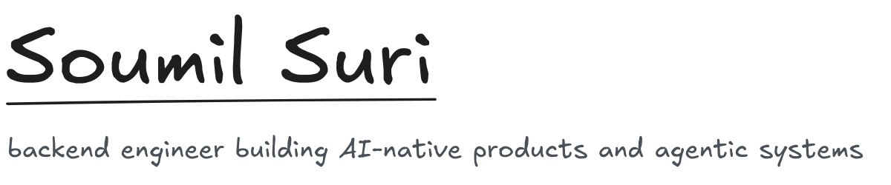
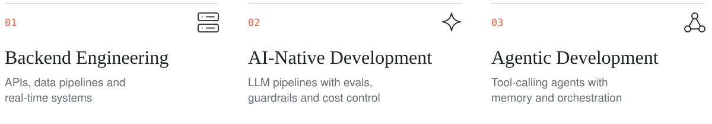
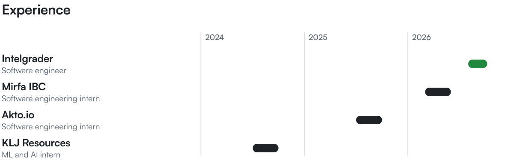
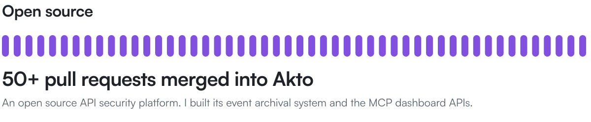
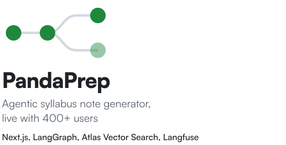
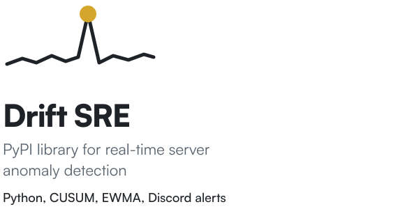

<picture><source media="(prefers-color-scheme: dark)" srcset="assets/hero-dark.svg"></picture>

**[Resume](https://drive.google.com/file/d/1eWfHjGG3wab-l89f27l7R8p7Y0l01mWi/view)** &nbsp;&nbsp;&nbsp; **[LinkedIn](https://linkedin.com/in/soumilsuri)** &nbsp;&nbsp;&nbsp; **[Portfolio](https://www.soumilsuri.me/)**

<br>

<picture><source media="(prefers-color-scheme: dark)" srcset="assets/expertise-dark.svg"></picture>

<br>


<br>

<picture><source media="(prefers-color-scheme: dark)" srcset="assets/experience-dark.svg"></picture>

<br>

<a href="https://github.com/akto-api-security/akto/pulls?q=is%3Apr+state%3Aclosed+author%3Asoumilsuri"><picture><source media="(prefers-color-scheme: dark)" srcset="assets/akto-dark.svg"></picture></a>

<picture><source media="(prefers-color-scheme: dark)" srcset="assets/projects-title-dark.svg"></picture>

<a href="https://github.com/soumilsuri/pandaprep-live"><picture><source media="(prefers-color-scheme: dark)" srcset="assets/pandaprep-dark.svg"></picture></a>
<a href="https://github.com/soumilsuri/Drift"><picture><source media="(prefers-color-scheme: dark)" srcset="assets/drift-dark.svg"></picture></a>

<br>

Copy my email:

```text
soumilsuri@gmail.com
```
