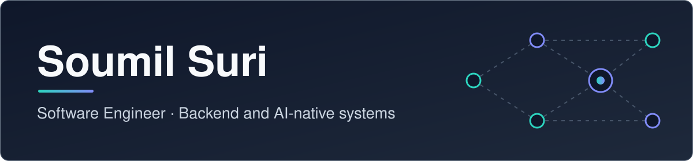
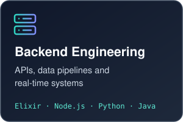
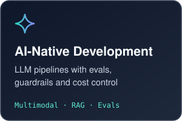
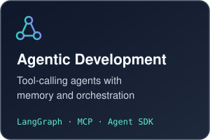
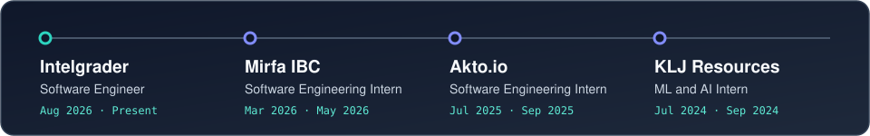
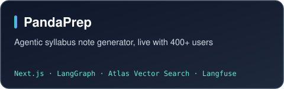
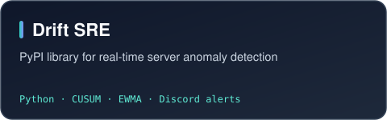
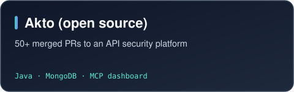
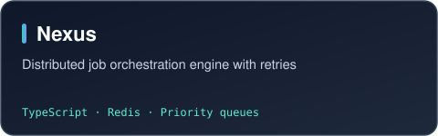

  

  
  
  
  

I build backend systems and AI-native products: LLM pipelines, tool-calling agents and the evals that keep them correct and cheap in production.

  
  
  

  

### Experience

  

### Projects

  
  
  
  

